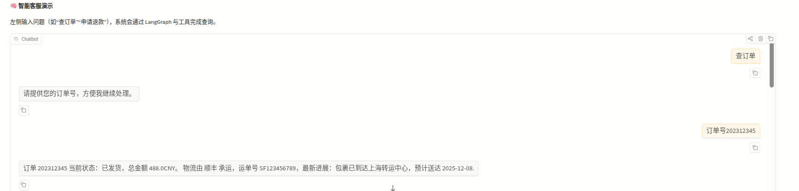
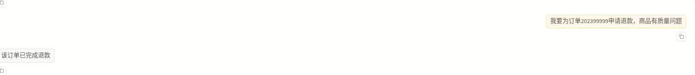
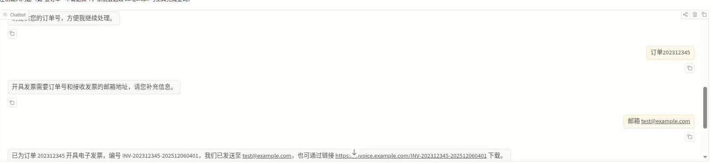

# 第四周作业

## 任务
构建一个小型多轮对话智能客服，支持工具调用以及模型与插件的热更新。

## 作业思路指导
### 阶段一：基础对话系统搭建
使用 LangChain 构建基础 Chain：Prompt → LLM → OutputParser
用户说“我昨天下的单”，系统能结合当前时间推断“昨天”的具体日期

### 阶段二：多轮对话与工具调用
实现“订单查询”“退款申请”等多轮交互流程，支持工具自动调用。
使用 LangGraph 构建以下流程：
- 用户说“查订单” → 追问“请提供订单号”
- 收到订单号后 → 调用 query_order(order_id) 工具
- 返回订单状态与物流信息

### 阶段三：热更新与生产部署
实现模型与插件的热更新，完成系统部署与监控。
1. 模型热更新
2. 插件热重载
3. 暴露健康检查接口 /health
4. 编写自动化测试脚本
- 测试“发票开具”插件的功能正确性
- 验证热更新后旧会话不受影响

## 如何提交作业
请fork本仓库，然后在以下目录分别完成编码作业：
- [week04-homework/smart_customer_service](./smart_customer_service)

其中:
- main.py是作业的入口


完成作业后，请在【极客时间】上提交你的fork仓库链接，精确到本周的目录，例如：
```
https://github.com/your-username/ai-engineer-training/tree/main/week04-homework
```

## 使用手册与测试语录

- 完整的运行步骤、环境变量说明、热更新指南与“测试用交互语录”已整理在 [`USAGE.md`](./USAGE.md)。
- 关键测试场景示例：
	- **订单查询**：`查订单` → `订单号202312345`，返回顺丰物流 `SF123456789`。
	- **132465 物流直查**：一句话给出 6 位订单号也能命中，返回菜鸟裹裹进展。
	- **发票开具**：多轮补齐订单号与邮箱，提示“已向 test@example.com 发送电子发票”。
	- **退款申请**：`我要为订单202399999申请退款`，触发退款工具并返回审核描述。

	### 示例界面截图

	| 场景 | 预览 |
	| --- | --- |
	| 订单查询 |  |
	| 退款申请 |  |
	| 发票开具 |  |

## 实现概览

- **阶段一**：`smart_customer_service/model/local_llm.py` 提供可配置的 Deterministic LLM，结合 `langchain` 的 Prompt → LLM → OutputParser Chain，可根据当前时区推断“昨天”具体日期。
- **阶段二**：`smart_customer_service/workflow/graph.py` 使用 LangGraph 编排多轮对话，内置订单查询、退款申请、发票插件调用等工具节点，并通过 `SessionStore` 维持多会话记忆。
- **阶段三**：`smart_customer_service/app.py` 暴露 FastAPI 服务，`ServiceRuntime` 支持 `/reload/model` 与 `/reload/plugins` 热更新，同时提供 `/health` 监控接口与自动化测试覆盖发票插件及热更新场景。

## 目录结构

- `smart_customer_service/`
	- `main.py`：程序入口，使用 `uvicorn` 启动服务。
	- `app.py`：FastAPI 路由定义（/chat、/health、热更新接口）。
	- `runtime.py`：聚合会话、LangGraph、插件与工具的运行时。
	- `orders.py` / `tools.py`：内置订单数据与查询、退款工具。
	- `plugins/`：插件系统及“发票开具”插件。
	- `workflow/`：意图路由与 LangGraph 定义。
	- `model/`：本地可热更新的 Deterministic LLM。
- `tests/`：pytest 自动化测试（发票流程 & 热更新会话保持）。

## 运行步骤（基于 uv）

```bash
# 安装依赖
uv sync

# 启动服务（默认 0.0.0.0:8000）
uv run python -m smart_customer_service.main
```

### 前置依赖

- Python 3.11+
- [uv](https://github.com/astral-sh/uv)（已在项目中使用，用于安装依赖与运行命令）
- 可选：真实 DashScope API Key（接入千问时需要）

### 快速自测

1. 运行上面命令启动服务。
2. 在另一个终端调用：
	```bash
	curl -X POST http://127.0.0.1:8000/chat \
		  -H "Content-Type: application/json" \
		  -d '{"session_id":"demo","message":"查订单"}'
	```
3. 首次会提示补充订单号，再发送 `{"session_id":"demo","message":"订单号202312345"}` 即可看到工具调用结果，同时 `/health` 可检查模型与插件状态。

启动后可通过以下接口交互：

| 方法 | 路径 | 说明 |
| --- | --- | --- |
| `GET` | `/health` | 查看健康状态、当前 LLM 提供方以及已加载插件 |
| `POST` | `/chat` | 多轮对话入口 `{"session_id": "u1", "message": "查订单"}` |
| `POST` | `/reload/model` | 动态更新 system prompt、语气及 LLM 提供方 |
| `POST` | `/reload/plugins` | 重新扫描并加载插件 |

## Gradio 可视化界面

仓库内置了基于 Gradio 的简单 Web 前端（`smart_customer_service/gradio_ui.py`），通过 HTTP 调用 `/chat` 接口，可在浏览器中体验多轮客服流程。

### 一键启动脚本

```bash
chmod +x scripts/run_with_gradio.sh
./scripts/run_with_gradio.sh
```

脚本流程：

1. 使用 `uv run python -m smart_customer_service.main` 启动 FastAPI 后端；
2. 自动设置 `SMART_CS_GRADIO_BACKEND`（默认 `http://127.0.0.1:8000`）；
3. 启动 Gradio UI（默认监听 `0.0.0.0:7860`）；
4. 当关闭 Gradio 窗口时自动停止后端进程。

若后端已在运行，可单独启动前端：

```bash
SMART_CS_GRADIO_BACKEND=http://127.0.0.1:8000 \
uv run python -m smart_customer_service.gradio_ui
```

| 环境变量 | 作用 | 默认值 |
| --- | --- | --- |
| `SMART_CS_GRADIO_BACKEND` | 后端 API 地址 | `http://127.0.0.1:8000` |
| `SMART_CS_GRADIO_HOST` / `SMART_CS_GRADIO_PORT` | Gradio 服务监听地址与端口 | `0.0.0.0` / `7860` |
| `SMART_CS_GRADIO_TIMEOUT` | 前端调用后端的超时时间（秒） | `30` |

Gradio 界面包含聊天窗口、输入框与“清空对话”按钮，并自动维护 `session_id`，确保 Web 端与后端共享一致的多轮上下文。

### 配置项速查表

| 变量名 | 说明 | 默认值 |
| --- | --- | --- |
| `SMART_CS_HOST` / `SMART_CS_PORT` | FastAPI 监听地址与端口 | `0.0.0.0` / `8000` |
| `SMART_CS_SYSTEM_PROMPT` | 系统提示词 | 温暖客服提示词 |
| `SMART_CS_LLM_PROVIDER` | `local` 使用内置 LLM；`tongyi` 直连千问 | `local` |
| `SMART_CS_LLM_TEMPERATURE` | 语言模型采样温度 | `0.2` |
| `SMART_CS_DASHSCOPE_MODEL` | 千问模型名（如 `qwen-plus`） | `qwen-plus` |
| `DASHSCOPE_API_KEY` / `SMART_CS_DASHSCOPE_API_KEY` | 千问 API 密钥 | `None` |

若使用 `.env`，上述变量均可直接填入；DashScope API key 也支持系统环境变量。

### API 示例

**/chat 请求**

```json
{
	"session_id": "u1001",
	"message": "我要查一下订单202312345的物流"
}
```

**/chat 响应（片段）**

```json
{
	"session_id": "u1001",
	"reply": "订单 202312345 当前状态：已发货，总金额 488.0CNY...",
	"intent": "order",
	"slots": {},
	"tool_events": [
		{
			"tool": "query_order",
			"data": {"order_id": "202312345", "status": "已发货", "logistics": {...}}
		}
	]
}
```

**/reload/model 请求**

```json
{
	"provider": "tongyi",
	"dashscope_model": "qwen-max",
	"system_prompt": "You are an English agent.",
	"temperature": 0.1
}
```

响应中会返回最新 provider 与 style，方便确认热更新结果。

## 对接通义千问（Qwen）

项目默认使用本地 Deterministic LLM，若要切换至阿里云 DashScope（通义千问）模型：

1. 在 `.env` 中配置密钥
	```env
	DASHSCOPE_API_KEY=your-real-key
	```
2. 设置以下环境变量（可写入 `.env`，或运行前导出）
	```env
	SMART_CS_LLM_PROVIDER=tongyi
	SMART_CS_DASHSCOPE_MODEL=qwen-plus   # 可选：qwen-max、qwen-turbo 等
	SMART_CS_LLM_TEMPERATURE=0.2         # 可选：回复温度
	```
3. 运行 `uv run python -m smart_customer_service.main`，`/health` 接口会展示当前 provider=`tongyi`，对话即通过 LangChain 的 `ChatTongyi` 直连千问。
4. 如需运行时切换，可调用 `/reload/model`：
	```bash
	curl -X POST http://localhost:8000/reload/model \
		  -H "Content-Type: application/json" \
		  -d '{"provider":"tongyi","dashscope_model":"qwen-max"}'
	```

## 自动化测试

```bash
uv run pytest
```

### 开发/调试小贴士

- `uv run python -m smart_customer_service.main --reload` 可结合 `uvicorn` 热重载（如需，可在 `main.py` 中调整）。
- 若要重置内存中的多轮会话，可重启进程或在 `ServiceRuntime` 中扩展清理接口。
- 插件开发：在 `smart_customer_service/plugins/` 新增模块并实现 `build_plugin` factory，调用 `/reload/plugins` 即可生效。